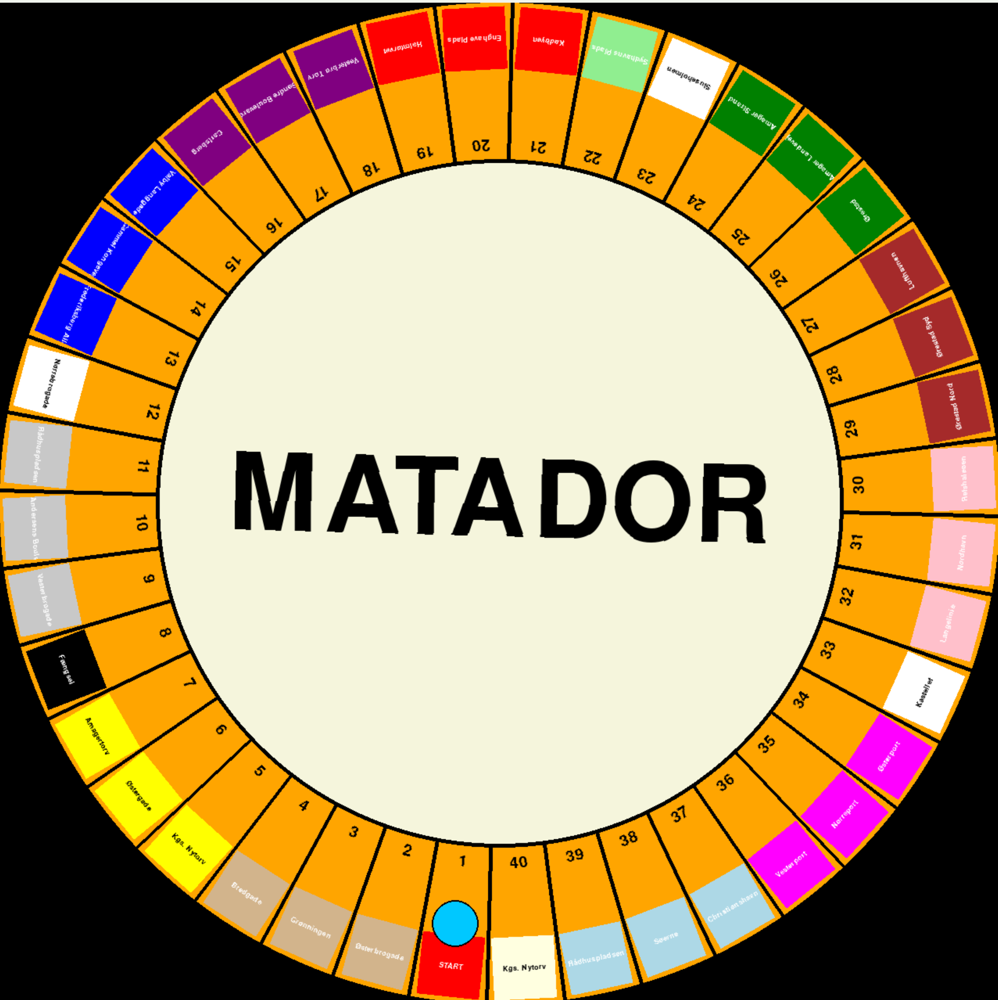

# MATADOR SPIL ENGINE
Dette er en simpel implementering af en spil engine for det klassiske brætspil Matador. Det er skrevet i Python og er designet til at være let at forstå og udvide.

## BACKEND
Der er tre hovedkomponenter i backend:
- `brik.py`: Indeholder definitionen af brikkerne på brættet, deres priser og andre relevante oplysninger.
- `spiller.py`: Indeholder definitionen af spilleren, herunder deres navn, position på brættet, penge og ejendomme.
- `bræt.py`: Indeholder definitionen af brættet, herunder spillere og brikker. Brættet håndterer også spillets logik, såsom at flytte spillere, købe ejendomme og betale leje.

## SPIL
Spillet starter ved at oprette en instans af `Bræt` klassen, som automatisk opretter spillere og brikker. Spillerne kan derefter flytte rundt på brættet, købe ejendomme og betale leje.
<!-- Inkluder billede -->
